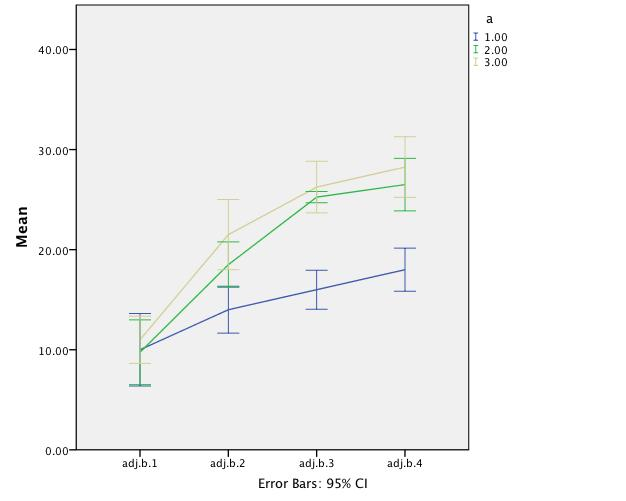

In this document we describe an easy method to adjust observed scores for correct visualisation of error bars for mixed design ANOVA in SPSS. Mixed designs are frequently used for effect studies in psychology to study the effect of a treatment while implementing a control group. One of the problems with this analysis is that the omnibus result of the interaction does not indicate where the effects occur. Also subsequent contrast analyses do not in all cases yield answers to specific hypotheses, where one specific condition needs to be compared to some other specific condition. Especially the Helmert contrast analysis makes this impossible and is also very difficult to interpret. It is widely seen as good practice to include error bars to interaction graphs so that the effect can be visually inspected. Though this is easy to achieve in SPSS for independent groups, for mixed designs the default solution to produce error bars goes horribly wrong. Field (2013) thoroughly explains how to create adjustment vectors for the one-way repeated measure ANOVA but falls short for the mixed design ANOVA.

We will rely heavily on Keppel & Wickens' (2004) excellent book "Design and analysis, a researcher's handbook" where they in chapter 19 explain thoroughly how to calculate the sums of squares in two-factor mixed design analysis. For the calculation of the correct error bars we are mainly interested in the interaction error term

$$SS_{B \times S/A} = [Y] - [AB] - [AS] + [A]$$

Keppel & Wickens use bracket notations where they define $[Y]$ as $\sum Y^2_{ijk}$, $[AB] = \frac{\sum AB^2_{jk}}{n}$, $[AS] = \frac{\sum SA^2_{ij}}{b}$ and $[A]$ as $\frac{\sum A^2_{j}}{bn}$. We will reproduce table 19.1 from Keppel & Wickens for better framing of the above formulas.

Table 19.1: Notational system for the $A \times (B \times S)$ design.
<hr>
Original $ABS$ table containing the scores $Y_{ijk}$ and subject sums $SA_ij$ 

.     | .        | $b_1$     | $b_2$     | $b_3$     | SUM      
------|----------|-----------|-----------|-----------|----------
.     | $s_{11}$ | $Y_{111}$ | $Y_{112}$ | $Y_{113}$ | $SA_{11}$
$a_1$ | $s_{21}$ | $Y_{211}$ | $Y_{212}$ | $Y_{213}$ | $SA_{21}$
.     | $s_{31}$ | $Y_{311}$ | $Y_{312}$ | $Y_{313}$ | $SA_{31}$
.     | $s_{12}$ | $Y_{121}$ | $Y_{122}$ | $Y_{123}$ | $SA_{12}$
$a_2$ | $s_{22}$ | $Y_{221}$ | $Y_{222}$ | $Y_{223}$ | $SA_{22}$
.     | $s_{32}$ | $Y_{321}$ | $Y_{322}$ | $Y_{323}$ | $SA_{32}$

Summary tables of sums

AB table

.     | $b_1$     | $b_2$     | $b_3$     | Sum
------|-----------|-----------|-----------|-----
$a_1$ | $AB_{11}$ | $AB_{12}$ | $AB_{13}$ | $A_1$
$a_1$ | $AB_{21}$ | $AB_{22}$ | $AB_{23}$ | $A_2$
Sum   | $B_{1}$   | $B_{2}$   | $B_{3}$   | T

Subject sums

$a_1$     | $a_2$    
----------|----------
$SA_{11}$ | $SA_{12}$
$SA_{21}$ | $SA_{22}$
$SA_{31}$ | $SA_{32}$
$A_{1}$   | $A_{2}$

We will also use their example in table 19.4 to compare our results. We will first calculate $SS_{B \times S/A}$ based on the given example and the bracket notation.

```{r}
a = 3 # Number of levels in the between factor A
b = 4 # Number of levels in the within factor B
n = 4 # Number of subjects per A X B

a = c( 1, 1, 1, 1, 2, 2, 2, 2, 3, 3, 3, 3)

b.1 = c(13,10,13, 4, 5, 8,14,12,13, 9,14, 8)
b.2 = c(14,11,19,12,13,18,19,24,24,22,22,18)
b.3 = c(17,15,18,14,21,25,26,29,28,22,28,27)
b.4 = c(20,14,22,16,24,27,26,29,32,24,28,29)

m <- data.frame(a, b.1, b.2, b.3, b.4)

m
```

### Write data file to a text file
```{r, eval=FALSE}
write.table(m, file = "datafile.txt", row.names = FALSE)
```

### Import data file into SPSS

```{r, eval=FALSE}


GET DATA  /TYPE=TXT
  /FILE="/Users/JolandaKossakowski/Dropbox/UvA Folders/CI for mixed design/datafile.txt"
  /ENCODING='Locale'
  /DELCASE=LINE
  /DELIMITERS=" "
  /QUALIFIER='"'
  /ARRANGEMENT=DELIMITED
  /FIRSTCASE=2
  /IMPORTCASE=ALL
  /VARIABLES=
  a F1.0
  b.1 F2.0
  b.2 F2.0
  b.3 F2.0
  b.4 F2.0.
CACHE.
EXECUTE.
DATASET NAME DataSet2 WINDOW=FRONT.

```

### Calculate [Y]

$$[Y] = \sum Y^2_{ijk}$$

```{r}
Y = sum(m[,grep("b", names(m))]^2)
Y
```

### Calculate [AB]

$$[AB] = \frac{\sum AB^2_{jk}}{n} $$

```{r}
AB.table <- aggregate(cbind(b.1, b.2, b.3, b.4) ~ a, m, sum)[,2:5]  
AB.table

AB = sum(AB.table^2) / n
AB  
```

### Calculate [AS]

$$[AS] = \frac{\sum SA^2_{ij}}{b} $$

```{r}
AS.table <- apply(m[, c('b.1', 'b.2', 'b.3', 'b.4')], 1, sum)
AS.table

AS = sum(AS.table^2) / b
AS
```

### Calculate [A]

$$[A] = \frac{\sum A^2_{j}}{bn}$$


```{r}
A.sums  <- apply(m[, c('b.1', 'b.2', 'b.3', 'b.4')], 1, sum)
A.table <- apply( aggregate(cbind(b.1, b.2, b.3, b.4) ~ a, m, sum)[,2:5] , 1, sum)
A.table

A = sum(A.table^2) / (b*n)
A
```

### Calculate $SS_{B \times S/A}$

The sum of squares for the interaction error term.

$$[Y] - [AB] - [AS] + [A]$$

```{r}
Y - AB - AS + A
```

## Non bracket notation

For implementation in SPSS we would like a simple method based on calculating means. We therefore propose calculating an adjustment factor in line with Field (2013). 

Below $Y_{ijk}$ represents the score by subject $s_i$ who was part of independent group $a_j$ on measurement $b_k$. We calculate the mean of B for each person which we will call $SA_{ij} = \frac{\sum Y_k}{b}$, where $b$ is the number of repeated measures, and the grand mean for the specific groups $A_j =  \frac{\sum SA_{ij}}{s}$, where $s$ is the number of independent groups.

.     | .        | $b_1$     | $b_2$     | $b_3$     | B mean    | A mean 
------|----------|-----------|-----------|-----------|-----------|-------
.     | $s_{11}$ | $Y_{111}$ | $Y_{112}$ | $Y_{113}$ | $SA_{11}$ | $A_1$
$a_1$ | $s_{21}$ | $Y_{211}$ | $Y_{212}$ | $Y_{213}$ | $SA_{21}$ | $A_1$
.     | $s_{31}$ | $Y_{311}$ | $Y_{312}$ | $Y_{313}$ | $SA_{31}$ | $A_1$
.     | $s_{12}$ | $Y_{121}$ | $Y_{122}$ | $Y_{123}$ | $SA_{12}$ | $A_2$
$a_2$ | $s_{22}$ | $Y_{221}$ | $Y_{222}$ | $Y_{223}$ | $SA_{22}$ | $A_2$
.     | $s_{32}$ | $Y_{321}$ | $Y_{322}$ | $Y_{323}$ | $SA_{32}$ | $A_2$

Using the B means and the A means we can create the adjustment factor $( SA_{ij} - A_j )$. By adjusting $Y_{ijk}$ with this factor we create the corrected values $C_{ijk}$.

$$ C_{ijk} = Y_{ijk} + ( A_j - SA_{ij} ) $$

.     | .        | $b_1$     | $b_2$     | $b_3$     
------|----------|-----------|-----------|----------
.     | $s_{11}$ | $C_{111}$ | $C_{112}$ | $C_{113}$
$a_1$ | $s_{21}$ | $C_{211}$ | $C_{212}$ | $C_{213}$
.     | $s_{31}$ | $C_{311}$ | $C_{312}$ | $C_{313}$
.     | $s_{12}$ | $C_{121}$ | $C_{122}$ | $C_{123}$
$a_2$ | $s_{22}$ | $C_{221}$ | $C_{222}$ | $C_{223}$
.     | $s_{32}$ | $C_{331}$ | $C_{322}$ | $C_{323}$

In the final step we calculate the means per B and A, $AB_{jk}$. So the mean for $a_1 b_1$, $a_1 b_2$ and so on.

.     | $b_1$     | $b_2$     | $b_3$     
------|-----------|-----------|----------
$a_1$ | $AB_{11}$ | $AB_{12}$ | $AB_{13}$
$a_1$ | $AB_{21}$ | $AB_{22}$ | $AB_{23}$

With these means we can calculate the sum of squares of the interaction error term.

$$SS_{B \times S / A} = \sum ( C_{ijk} - AB_{jk} )^2$$

Which is equal to

$$[Y] - [AB] - [AS] + [A]$$

### Showing it's equal

```{r, eval=TRUE}
# Calculate B and A mean
m$B.mean   <- apply(m[, c('b.1', 'b.2', 'b.3', 'b.4')], 1, mean)
m$A.mean   <- rep(aggregate(B.mean ~ a, m, mean)$B.mean, each = n)

# Calculate adjustment factor
m$adj      <- m$A.mean - m$B.mean

# Apply adjustment factor
adj        <- m[, c('b.1', 'b.2', 'b.3', 'b.4')] + m$adj
names(adj) <- paste("adj.",names(adj), sep='')

m <- cbind(m, adj)
m

# Calculate subgroup means for the adjusted values
mean.adj <- aggregate(cbind(adj.b.1, adj.b.2, adj.b.3, adj.b.4) ~ a, m, mean)[,2:5]

mean.adj

# Put results in matrix
mean.adj.all <- rbind(matrix(rep(mean.adj[1,], 4), 4, 4, byrow = TRUE), 
                      matrix(rep(mean.adj[2,], 4), 4, 4, byrow = TRUE), 
                      matrix(rep(mean.adj[3,], 4), 4, 4, byrow = TRUE))

# Change names
colnames(mean.adj.all) <- paste("mean.", names(adj), sep = '')

# Calculate difference for adjuested values
m[, grep("^adj\\.", names(m))] <- m[, grep("^adj\\.", names(m))] - as.numeric(mean.adj.all)
m

# Calculate sums of squares for the interaction error term
sum(m[, grep("^adj\\.", names(m))]^2)

```

## SPSS implementation

For implementation in SPSS we only need to calculate the correction factor and apply this to the initial values.

```{r, eval=FALSE}
COMPUTE B.mean=MEAN(b.1 to b.4).
EXECUTE.

AGGREGATE
  /OUTFILE=* MODE=ADDVARIABLES
  /BREAK=a
  /A.mean=MEAN(B.mean).

COMPUTE adj=B.mean - A.mean.
EXECUTE.

COMPUTE adj.b.1=b.1 - adj.
COMPUTE adj.b.2=b.2 - adj.
COMPUTE adj.b.3=b.3 - adj.
COMPUTE adj.b.4=b.4 - adj.
EXECUTE.
```

Depending on the amount of repeated measures you would have to adjust the above syntax. You can use the adjusted variables in SPSS to create the error bar chart. SPSS will use the common procudure $\frac{s}{\sqrt{n}}$ to calculate the standard error $SE$ and add and subtract $1.96 \times SE$ from the group mean to create the confidence interval.

```{r, eval=FALSE}
* Chart Builder.
GGRAPH
  /GRAPHDATASET NAME="graphdataset" VARIABLES=MEANCI(adj.b.1, 95) MEANCI(adj.b.2, 95) 
    MEANCI(adj.b.3, 95) MEANCI(adj.b.4, 95) a MISSING=LISTWISE REPORTMISSING=NO
    TRANSFORM=VARSTOCASES(SUMMARY="#SUMMARY" INDEX="#INDEX" LOW="#LOW" HIGH="#HIGH")
  /GRAPHSPEC SOURCE=INLINE.
BEGIN GPL
  SOURCE: s=userSource(id("graphdataset"))
  DATA: SUMMARY=col(source(s), name("#SUMMARY"))
  DATA: INDEX=col(source(s), name("#INDEX"), unit.category())
  DATA: a=col(source(s), name("a"), unit.category())
  DATA: LOW=col(source(s), name("#LOW"))
  DATA: HIGH=col(source(s), name("#HIGH"))
  GUIDE: axis(dim(2), label("Mean"))
  GUIDE: legend(aesthetic(aesthetic.color.interior), label("a"))
  GUIDE: text.footnote(label("Error Bars: 95% CI"))
  SCALE: cat(dim(1), include("0", "1", "2", "3"))
  SCALE: linear(dim(2), include(0))
  ELEMENT: line(position(INDEX*SUMMARY), color.interior(a), missing.wings())
  ELEMENT: interval(position(region.spread.range(INDEX*(LOW+HIGH))), shape.interior(shape.ibeam), 
    color.interior(a))
END GPL.
```



## Youtube instruction

A Youtube instruction for SPSS implementation can be found below.

<iframe width="560" height="315" src="http://www.youtube.com/embed/XL_N2F9HUAQ?list=PLCO-DS6d03z86EXtLJXhdMMt8tS5Jn3AE" frameborder="0" allowfullscreen></iframe>

http://youtu.be/XL_N2F9HUAQ?list=PLCO-DS6d03z86EXtLJXhdMMt8tS5Jn3AE
